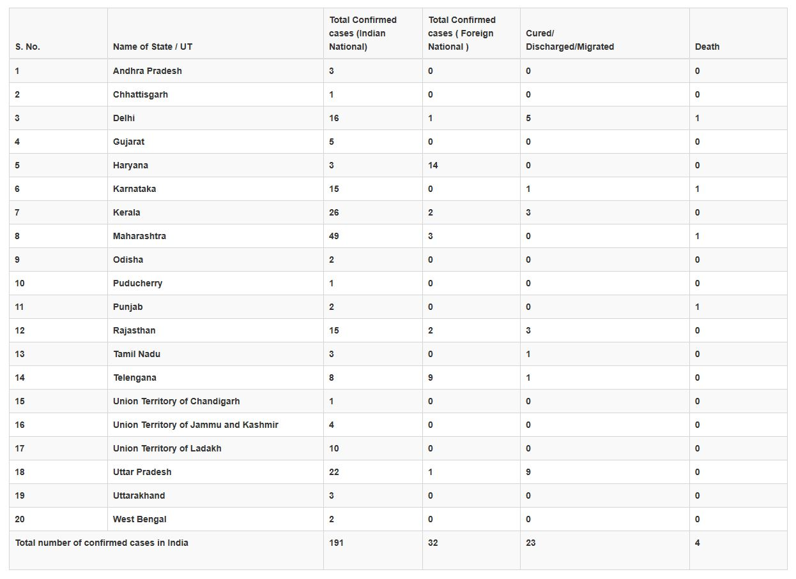

# Real-Time-COVID-19-Tracker-for-Slack
This automated tracker tracks the spread of Covid-19 in a real time basis by scraping data from Ministry of Health and Family Welfare and notifies the same at Slack

# What it does

It scrapes the below table periodically from website of Ministry of Health and Family Welfare(https://www.mohfw.gov.in/).



If any changes has happened to the table compared to the state of last time checked, it creates a message describing the change and sends the message to a given user/channel in Slack.

There are two kinds of notifier supported right now. One that notifies about statelevel cases of Covid-19 and another that notifies about total cases. The two notifiers are seperated out in two directories of the repository.

# Pre-requisites

<h4>Python 2.7.x </h4>

<h4>Latest <b>pip</b> with all envirionment variables set</h4>

<h4> Slack API Token for SlackBot </h4>

# How to Set up the tracker

Run the following commands:

```
  pip install beautifulsoup4
  pip install requests
  pip install slacker
```

Then simply run the Notifier.py or notifier.py file from Statewise notifier or Total cases notifier as per need by running the below command in Command Prompt

```
py Notifier.py
```
